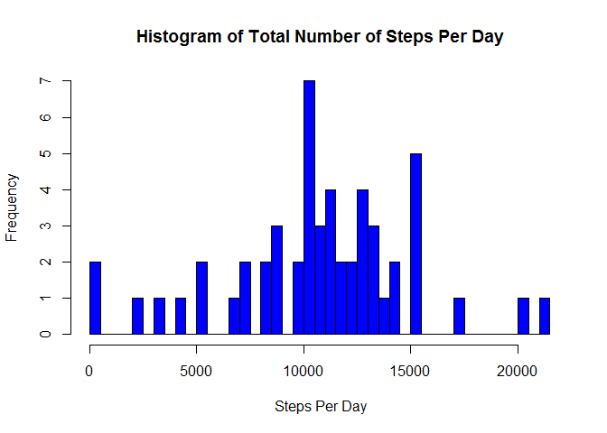

# Reproducible Research: Peer Assessment 1


## Loading and preprocessing the data
<span style="color:blue">NOTE: Specific answers to questions are typed in blue</span>  
Enable caching.

```r
knitr::opts_chunk$set(cache=TRUE)
```
**1. Load the data (i.e. read.csv())** 
Unzip zip file.

```r
unzip("activity.zip")
time = timestamp()
```

```
## ##------ Sun Dec 13 16:39:17 2015 ------##
```
Load the data into R.  
Assign data to the variable activity.

```r
activity <- read.csv("activity.csv")
```
**2. Process/transform the data (if necessary) into a format suitable for your analysis.**  

Take a look at the data.

```r
str(activity)
```

```
## 'data.frame':	17568 obs. of  3 variables:
##  $ steps   : int  NA NA NA NA NA NA NA NA NA NA ...
##  $ date    : Factor w/ 61 levels "2012-10-01","2012-10-02",..: 1 1 1 1 1 1 1 1 1 1 ...
##  $ interval: int  0 5 10 15 20 25 30 35 40 45 ...
```
Change class of date variable from factor to POSIXct.

```r
activity$date <- as.POSIXct(activity$date)
class(activity$date)
```

```
## [1] "POSIXct" "POSIXt"
```
## What is mean total number of steps taken per day?

**1. Calculate the total number of steps taken per day.**

```r
Steps <- aggregate(activity$steps, list(activity$date), sum)
names(Steps) <- c("date", "StepsPerDay")
head(Steps)
```

```
##         date StepsPerDay
## 1 2012-10-01          NA
## 2 2012-10-02         126
## 3 2012-10-03       11352
## 4 2012-10-04       12116
## 5 2012-10-05       13294
## 6 2012-10-06       15420
```

**2. If you do not understand the difference between a histogram and a barplot, research the difference between them. Make a histogram of the total number of steps taken each day**

```r
hist(Steps$StepsPerDay, breaks = 50, xlim = c(0, max(Steps$StepsPerDay, na.rm = TRUE)+400), col = rgb(0,0,1), main = "Histogram of Total Number of Steps Per Day", xlab = "Steps Per Day")
```

 

**3. Calculate and report the mean and median of the total number of steps taken per day.**


```r
meanSteps <- mean(Steps$StepsPerDay, na.rm = TRUE)
medianSteps <- median(Steps$StepsPerDay, na.rm = TRUE)
```
<span style="color:blue">The mean of the total number of steps taken per day is **10766.**  
The median of the total number of steps taken per day is **10765.**</span>

## What is the average daily activity pattern?

**1. Make a time series plot (i.e. type = "l") of the 5-minute interval (x-axis) and the average number of steps taken, averaged across all days (y-axis)**


```r
activityPat <- aggregate(activity$steps, list(activity$interval), mean, na.rm = TRUE)
names(activityPat) <- c("interval", "average")
head(activityPat)
```

```
##   interval   average
## 1        0 1.7169811
## 2        5 0.3396226
## 3       10 0.1320755
## 4       15 0.1509434
## 5       20 0.0754717
## 6       25 2.0943396
```

```r
plot(activityPat$interval, activityPat$average, type = "l", col = "blue", main = "Time Series Plot\nOf The 5 Minute Interval And The Average Number Of Steps Taken\nAveraged Across All Days",  xlab = "5 Minute Interval", ylab = "Average Number Of Steps Across All Days")
```

 

**2. Which 5-minute interval, on average across all the days in the dataset, contains the maximum number of steps?**

```r
m <- which.max(activityPat$average)
maxInterval <- activityPat[m,1]
```
<span style="color:blue">The 5 minute interval that contains the maximum number of steps is **835**</span>


## Imputing missing values

Note that there are a number of days/intervals where there are missing values (coded as NA). The presence of missing days may introduce bias into some calculations or summaries of the data.

**1. Calculate and report the total number of missing values in the dataset (i.e. the total number of rows with NAs)**


```r
total_NAs <- nrow(activity[is.na(activity),])
```
<span style="color:blue">The total number of missing values in the datset is **2304**</span>

**2. Devise a strategy for filling in all of the missing values in the dataset. The strategy does not need to be sophisticated. For example, you could use the mean/median for that day, or the mean for that 5-minute interval, etc.**

activityPat contains the averages for each interval accross all days.  
I will use activityPat$average to impute missing values.

**3. Create a new dataset equal to the original dataset with missing data filled in.**

Assign copy of original dataset 'activity' to new data set called 'activity_new'.


```r
activity_new <- activity
```
Impute missing values


```r
activityPat$average <- as.integer(activityPat$average)
for (i in 1 : nrow(activity_new)) {
        if (is.na(activity_new$steps[i]) == FALSE) {
                activity_new$steps[i] = activity_new$steps[i]
                } else {
            for (j in 1: nrow(activityPat)) {
                    if (activity_new$interval[i] == activityPat$interval[j]) {
                            activity_new$steps[i] = activityPat$average[j]
                    }
            }
                }
}
```

Check 'activity_new' for missing values, to see that all NAs have been imputed.


```r
nrow(activity_new[is.na(activity_new),])
```

```
## [1] 0
```

**4. Make a histogram of the total number of steps taken each day and Calculate and report the mean and median total number of steps taken per day. Do these values differ from the estimates from the first part of the assignment? What is the impact of imputing missing data on the estimates of the total daily number of steps?**

** Breakdown of question 4.**

a. Plot histogram.


```r
Steps_new <- aggregate(activity_new$steps, list(activity_new$date), sum)
names(Steps_new) <- c("date", "StepsPerDay")
head(Steps_new)
```

```
##         date StepsPerDay
## 1 2012-10-01       10641
## 2 2012-10-02         126
## 3 2012-10-03       11352
## 4 2012-10-04       12116
## 5 2012-10-05       13294
## 6 2012-10-06       15420
```

```r
hist(Steps_new$StepsPerDay, breaks = 50, xlim = c(0, max(Steps_new$StepsPerDay)+400), col = rgb(1,0,0), main = "Histogram of Total Number of Steps Per Day\nIncluding Imputed Values", xlab = "Steps Per Day")
```

-1.png) 

b. Calculate and report on mean and median total number of steps taken per day.


```r
mean_Steps_new <- as.integer(mean(Steps_new$StepsPerDay))
median_Steps_new <- median(Steps_new$StepsPerDay)
```

<span style="color:blue">The mean total number of steps taken per day is **10749**    
The median total number of steps taken per day is **10641**</span>  

c.  Do these values differ from the estimates from the first part of the assignment?


```r
mean_diff <- as.integer(mean(Steps_new$StepsPerDay) - mean(Steps$StepsPerDay, na.rm = TRUE))
median_diff <- median(Steps_new$StepsPerDay) - median(Steps$StepsPerDay, na.rm = TRUE)
if(mean_diff > 0) {meanPosNeg <- "greater than"
}else {meanPosNeg <- "less than"}
if(median_diff > 0) {medianPosNeg <- "greater than"
}else {medianPosNeg <- "less than"}
```
 
<span style="color:blue">The mean is **16 steps less than** the estimate from the first part of assignment.  
The median is **124 steps less than** the estimate from the first part of assignment.**</span>

d. What is the impact of imputing missing data on the estimates of the total daily number of steps? To answer this I plotted the histograms side by side and calculated the number of days that had missing data. I also calculated the number of steps imputed for each day.


```r
par(mfrow = c(1,3))
hist(Steps$StepsPerDay, xlim = c(0,25000), ylim = c(0,20), border = "blue", breaks = 50,  col = rgb(0,0,1), main = "Histogram with NAs omitted", xlab = "Steps Per Day")
abline(v = mean(Steps$StepsPerDay, na.rm = TRUE), col = "blue")
hist(Steps_new$StepsPerDay, xlim = c(0, 25000), ylim = c(0,20), border = "red", breaks = 50, col = rgb(1,0,0), main = "Histogram with imputed values", xlab = "")
abline(v = mean(Steps_new$StepsPerDay), col ="red")

hist(Steps_new$StepsPerDay, xlim = c(8500, 12500), ylim = c(0,20), border = "red", breaks = 50, col = rgb(1,0,0), main = "", xlab = "")
abline(v = mean(Steps_new$StepsPerDay), col ="red")
par(new = TRUE)
hist(Steps$StepsPerDay, xlim = c(8500, 12500), ylim = c(0,20), border = "blue", breaks = 50,  col = rgb(0,0,1), main = "Histogram Comparison", xlab = "Steps Per Day")
abline(v = mean(Steps$StepsPerDay, na.rm = TRUE), col = "blue")
```

 

Extract the number of days for which values were imputed.
Calculate the total number steps imputed each day.

```r
activityNA <- subset(activity, is.na(steps) == TRUE)
activityNA[,3] <- NULL
activityNA <- unique(activityNA)
DailyTotalImp <- sum(activityPat$average)
```
There are **8** days for which values are imputed.  
The total number of steps imputed for each of these days is **10641**. 

<span style="color:blue">**The increase in the data in the dataset with imputed values caused the mean and the median to move a little to the left(decrease).  All the imputed values are close to the mean. Outside the central area the imputed data has no effect.**</span>


## Are there differences in activity patterns between weekdays and weekends?

**For this part the weekdays() function may be of some help here. Use the dataset with the filled-in missing values for this part.**

**1. Create a new factor variable in the dataset with two levels – “weekday” and “weekend” indicating whether a given date is a weekday or weekend day.**

Create factor variable 'day' with 2 levels 'weekday' and 'weekend'. We have the dataset 'activity_new', which vae the imputed missing values.

Use 'rminer' package to change levels.


```r
activity_new$day <- as.factor(weekdays(activity_new$date))
str(activity_new)
```

```
## 'data.frame':	17568 obs. of  4 variables:
##  $ steps   : int  1 0 0 0 0 2 0 0 0 1 ...
##  $ date    : POSIXct, format: "2012-10-01" "2012-10-01" ...
##  $ interval: int  0 5 10 15 20 25 30 35 40 45 ...
##  $ day     : Factor w/ 7 levels "Friday","Monday",..: 2 2 2 2 2 2 2 2 2 2 ...
```

```r
library(rminer)
```

```
## Loading required package: kknn
```

```r
activity_new$day <- delevels(activity_new$day, c("Monday", "Tuesday", "Wednesday", "Thursday",  "Friday"), label = "weekday")
activity_new$day <- delevels(activity_new$day, c("Saturday", "Sunday"), label = "weekend")
str(activity_new)
```

```
## 'data.frame':	17568 obs. of  4 variables:
##  $ steps   : int  1 0 0 0 0 2 0 0 0 1 ...
##  $ date    : POSIXct, format: "2012-10-01" "2012-10-01" ...
##  $ interval: int  0 5 10 15 20 25 30 35 40 45 ...
##  $ day     : Factor w/ 2 levels "weekday","weekend": 1 1 1 1 1 1 1 1 1 1 ...
```
**2. Make a panel plot containing a time series plot (i.e. type = "l") of the 5-minute interval (x-axis) and the average number of steps taken, averaged across all weekday days or weekend days (y-axis). See the README file in the GitHub repository to see an example of what this plot should look like using simulated data.**

Use 'ggplot2' package to create panel plot with ggplot() function.


```r
library(ggplot2)

activity_Wday_Wend <- aggregate(activity_new$steps, list(activity_new$interval, activity_new$day), mean)
names(activity_Wday_Wend) <- c("interval", "day", "average")

g <-  ggplot(activity_Wday_Wend , aes(interval, average))

g + geom_line(aes(group = day, color = day)) + facet_grid(day ~ .) +
        labs(title = "Time Series Plot of the 5 Minute Interval
and the Average Number of Steps Taken
Averaged Across All Weekday Days or Weekend Days") +
        labs(x = "5 Minute Interval", y = "Average Number Of Steps Taken") +
        theme(panel.background = element_rect(color = "black"))
```

 
There is a peak in the number of steps at approximately 850/900. This corresponds with a time of about 8:00am. This peak is higher on the weekdays when people are going to work. Then there are numerous peaks throughout the day. I think that the subjects are more active on the weekends doing projects and sports.

